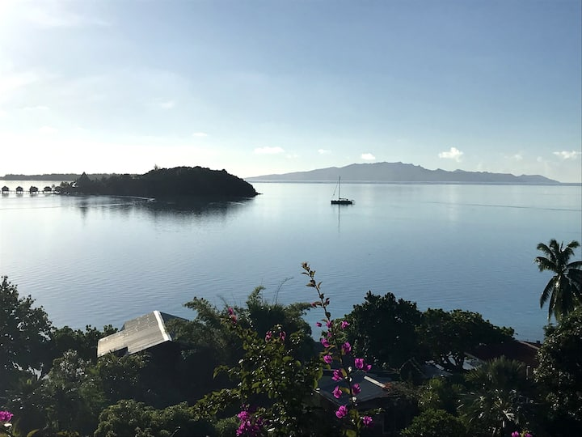

# imagescraper

This is a multi page web scraper that pulls images of Airbnb's in Chala, Peru and Bora-Bora, French Polynesia. It was built with BeautifulSoup, OS, Requests and Terminal to scape, download, rename and place the image into a new folder. It was made following a really helpful and informative YouTube tutorial I found <a href="https://www.youtube.com/watch?v=stIxEKR7o-c">here.</a>

